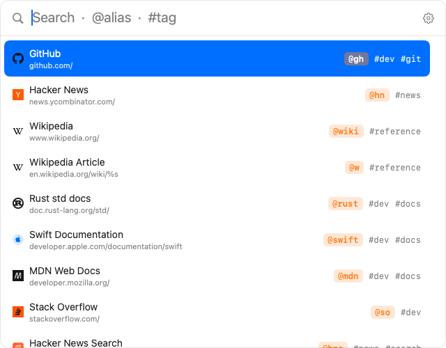
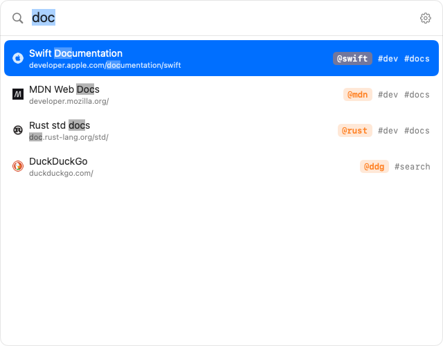
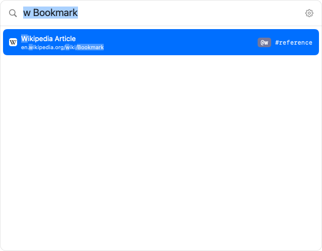
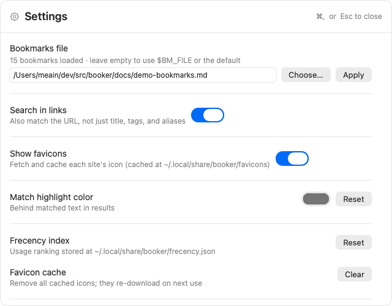

# booker

A fast, native macOS spotlight-style picker for your plaintext bookmarks.



Reads a plaintext Markdown file (`$BM_FILE`, default
`~/.local/share/bookmarks.md`) in the format:

```
- [Title](url) #tag1 #tag2 @alias1 @alias2
```

See the **[guide](docs/guide.md)** for the full file format, search syntax,
`%s` parameters, shortcuts, and file-location rules.

### Parameterized bookmarks (`%s`)

A URL may contain a `%s` placeholder. Selecting such a bookmark prompts for the
value, substitutes it into the URL, and opens the result:

```
- [Wikipedia Article](https://en.wikipedia.org/wiki/%s) #reference @w
- [Hacker News Search](https://hn.algolia.com/?q=%s) #search @hns
- [GitHub Issue](https://github.com/owner/repo/issues/%s) #dev @gi
```

Type the alias followed by the value — e.g. `w Bookmark` — and the bookmark
shows up with the URL already filled in (`en.wikipedia.org/wiki/Bookmark`), ready
to open. Or pick it with no value to get prompted.

## Features

- **Fuzzy search** over titles, tags, and aliases. In general search the
  priority is **alias > title > tag** — an alias hit always floats above a
  title-only hit, which floats above a tag-only hit.
- **Order-independent multi-word search** — "task work" finds "Workday Tasks".
  Each word must match (in any order); a straightforward in-order match ranks
  higher.
- **Scoped search by prefix**:
  - `@foo` — search **aliases** only
  - `#foo` — search **tags** only
  - bare `@` or `#` — list everything that has any alias / tag, by frecency
- **Aliases** shown as orange chips; tags in grey.
- **Match highlighting** — the matched text in each title/URL gets a subtle
  highlight (colour configurable in settings).
- **Frecency ranking** — bookmarks you open often (and recently) float to the
  top. With an empty query the list is ordered purely by frecency.
- **`%s` parameters** — type the alias then a value (`dp 123`) to open the
  filled URL directly, or pick the bookmark to get prompted.
- **Resizable & draggable** — drag anywhere on the window to move it, drag an
  edge to resize. The size and position are remembered across launches.
- **Favicons** — each site's icon is fetched (via DuckDuckGo's icon service) and
  cached to disk (`~/.local/share/booker/favicons/`), so they show instantly on
  later launches. On by default; toggle in settings.
- **Add / edit / delete** — **⌘N** adds a bookmark (seeded from the query:
  a `http(s)` query fills the URL, anything else the title; a URL-looking query
  with no matches also shows an "Add" row). The form auto-fetches the page
  title, suggests tags from other bookmarks on the same domain, warns on
  duplicate URLs, and shows the favicon. **⌘E** edits the selected bookmark;
  **⌘⌫** deletes it (with a confirm). Edits rewrite the exact line, leaving the
  rest of the file untouched.
- **Open all via shared alias** — give several bookmarks the same alias and
  typing it shows an **"Open all N · @alias"** row that opens them together
  (alias collisions are intentional, not an error).
- **Settings** (`⌘,` or the gear icon) — set the bookmarks file location, toggle
  URL search, toggle favicons, pick the match-highlight colour, reset the
  frecency index, clear the favicon cache, and open the format docs.

## Example use-cases

- **Keyboard site launcher** — alias your daily sites and jump by muscle memory.
  ```
  - [GitHub](https://github.com/) #dev @gh
  - [Gmail](https://mail.google.com/) @mail
  ```
  Type `@gh`, hit Enter. Frecency keeps your most-used ones on top for a blank query.

- **Issue / ticket jumper** — a `%s` bookmark plus the inline value opens the exact page:
  ```
  - [Jira issue](https://acme.atlassian.net/browse/PROJ-%s) #work @jira
  - [PR by number](https://github.com/acme/app/pull/%s) #work @pr
  ```
  Type `jira 4821` → opens `…/PROJ-4821`; `pr 210` → that pull request.

- **Search shortcuts** — put the query in the URL:
  ```
  - [Wikipedia](https://en.wikipedia.org/wiki/%s) @w
  - [npm](https://www.npmjs.com/search?q=%s) #dev @npm
  ```
  `w Ada Lovelace` → the article; `npm zod` → the search.

- **"Open all" a group** — one alias on several bookmarks opens them together:
  ```
  - [Prod dashboard](https://…/prod) #dash @dash
  - [Staging dashboard](https://…/staging) #dash @dash
  - [Logs](https://…/logs) #dash @dash
  ```
  Type `@dash` → **Open all 3 · @dash** launches your whole monitoring set at once.

- **Per-context bookmark files** — point Settings (or `$BM_FILE`) at a
  project-specific file, e.g. `~/work/project/.bookmarks.md`, to swap the whole
  set when you switch contexts.

## Screenshots

Fuzzy search with matched text highlighted:



Inline `%s` parameters — type the alias and a value to open the filled URL:



Settings — bookmarks file location, toggles, highlight colour, and caches:



## Keybindings

| Key | Action |
| --- | --- |
| type | filter |
| `↓` / `Ctrl-n` | next result |
| `↑` / `Ctrl-p` | previous result |
| `Enter` | open selected in browser |
| `⌘ Enter` | copy selected URL to clipboard |
| click | open that row |
| `⌘N` | add a bookmark |
| `⌘E` | edit selected bookmark |
| `⌘⌫` | delete selected bookmark (confirm with `↩`) |
| `⌘,` | open / close settings |
| `Esc` | close form/settings · back out of param mode · quit |

## Build

Requires the Swift toolchain (`swift --version`).

```sh
# Dev binary
swift build
./.build/debug/booker            # launch the picker
./.build/debug/booker list       # headless: dump parsed bookmarks (debug)

# Release .app bundle (recommended for a hotkey launcher)
./build-app.sh                   # produces ./Booker.app
open ./Booker.app
```

## Wiring up a hotkey

Booker launches fresh, grabs focus, and quits on select/escape, so it works
well as a hotkey target. Point your launcher at the `.app` bundle (`open -n`
forces a fresh instance each time):

- **[Hammerspoon](https://www.hammerspoon.org/)**:
  ```lua
  hs.hotkey.bind({"cmd", "shift"}, "b", function()
    hs.execute("open -n /path/to/booker/Booker.app")
  end)
  ```
- **[skhd](https://github.com/koekeishiya/skhd)**: `cmd + shift - b : open -n /path/to/booker/Booker.app`
- **[Raycast](https://www.raycast.com/) / [Alfred](https://www.alfredapp.com/)**: add a script/hotkey that runs `open -n .../Booker.app`.
